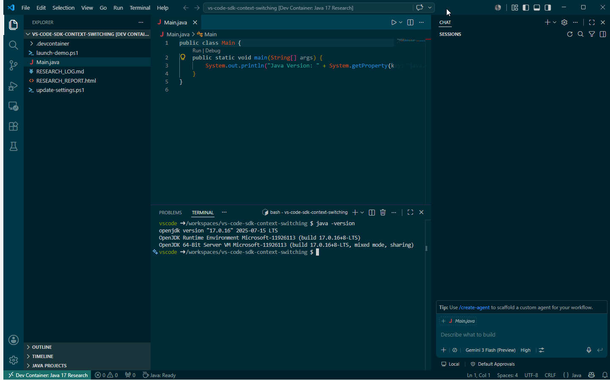
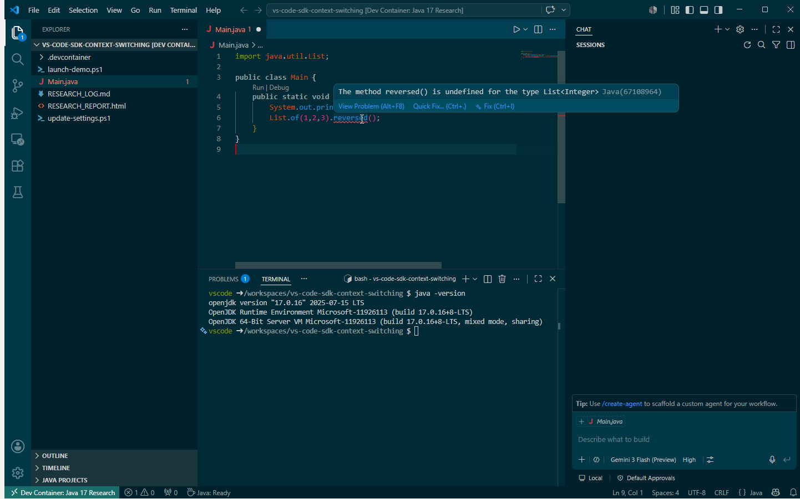
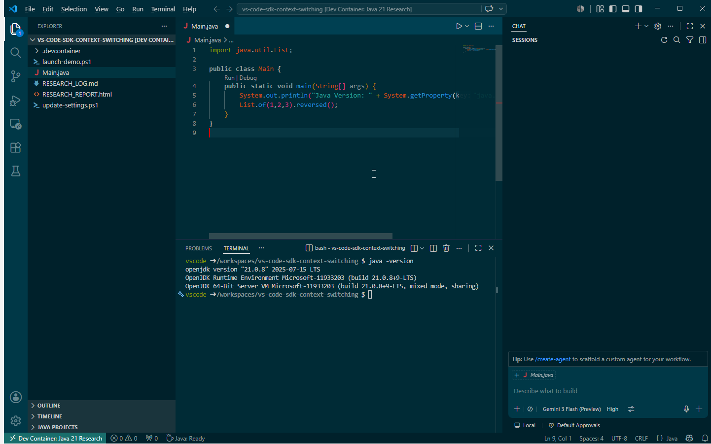

# Dev Container Side-by-Side Runbook (Version-Aware IntelliSense)

## Goal
Run two VS Code windows at the same time, each attached to a different Java dev container version.

This runbook is version-agnostic. The current demo uses Java 17 and Java 21 as concrete examples.

## Final Working State
- Two windows open from a single launcher script.
- Each window attaches to its own container.
- Java version and IntelliSense behavior differ correctly by window.

## Important: Host JDK Installation Is Not Required
For this workflow, you do not need to install or maintain a JDK on the host machine.

Why this matters:
- Build, run, and IntelliSense all use the JDK inside each dev container.
- Version management moves from host maintenance to container configuration.
- Developers can switch Java versions per workspace without changing host JDK installs.

Host requirements are only:
- Docker runtime available (for example Rancher Desktop).
- VS Code + Dev Containers extension.

## What Was Required

### 1) Launcher uses folder-based dev-container URIs
`launch-demo.ps1` launches two version-specific contexts (demo examples shown):
- `.devcontainer/java17`
- `.devcontainer/java21`

### 2) Wrapper devcontainer configs were added
Both context folders include a nested config file:
- `.devcontainer/java17/.devcontainer/devcontainer.json`
- `.devcontainer/java21/.devcontainer/devcontainer.json`

These wrappers explicitly set:
- `image` (17 or 21)
- `workspaceMount` to `/mnt/c/source/prototypes/vs-code-sdk-context-switching`
- `workspaceFolder` to `/workspaces/vs-code-sdk-context-switching`

This avoids config-resolution and mount-path issues seen during troubleshooting.

### 3) VS Code Dev Containers host settings were aligned to Rancher Desktop (Windows docker.exe)
In user settings:
- `dev.containers.dockerPath` points to Rancher Desktop `docker.exe`
- `remote.containers.dockerPath` points to Rancher Desktop `docker.exe`
- `dev.containers.executeInWSL` is `false`
- `remote.containers.executeInWSL` is `false`

This matched the successful backend mode and removed `/usr/bin/docker ENOENT` failures.

## Validation That It Works

### Runtime check
In each container terminal:
- Example A (Java 17 demo): `java -version` shows 17
- Example B (Java 21 demo): `java -version` shows 21

### IntelliSense check
Use the same line in both windows:

```java
List.of(1,2,3).reversed();
```

Expected:
- Example A (Java 17 demo): red squiggle (`reversed()` undefined)
- Example B (Java 21 demo): accepted (no error)

## Screenshot Evidence from This Session
From the provided chat screenshots:
- Java 17 demo window shows `java -version` = 17 and IntelliSense error on `reversed()`.
- Java 21 demo window shows `java -version` = 21 and no IntelliSense error on `reversed()`.

That confirms both containers and language servers are version-correct and isolated.
The same method applies to any other version pair.

Imported screenshots in this repo:
- `docs/images/java17-runtime-version.png`
- `docs/images/java21-runtime-version.png`
- `docs/images/java17-intellisense-reversed-undefined.png`
- `docs/images/java21-intellisense-reversed-supported.png`

Inline previews:






## Known Operational Risk
Rancher Desktop backend can intermittently fail startup (Hyper-V/WSL transport issues). When that happens, container launch fails regardless of repo config.

## Quick Recovery
1. Ensure Rancher Desktop is fully started.
2. Verify Docker is healthy:
   - `docker.exe version` should show both Client and Server.
3. Relaunch:
   - `./launch-demo.ps1`
